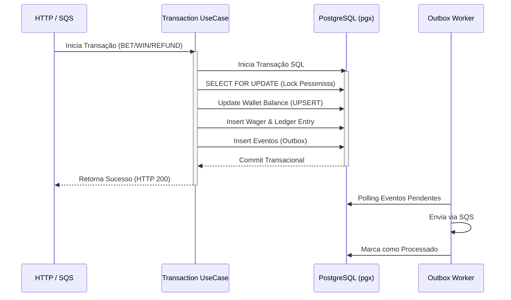

# Backend Challenge Go - Apostas Distribuídas

Este projeto é a resolução do desafio técnico para processamento distribuído de operações financeiras. A aplicação assegura consistência absoluta de saldo, idempotência, e entrega garantida de eventos em cenários de extrema concorrência e falhas de rede.

##  Arquitetura e Fluxo de Dados (Pessimistic Locking & Outbox)

A aplicação foi projetada em **Clean Architecture** com **Uber Fx** e gerencia simultaneamente tráfego HTTP e filas SQS, unificados na mesma transação atômica (`Unit of Work`).



## Como Rodar o Projeto

Toda a orquestração de dependências (PostgreSQL, LocalStack, Keycloak) está encapsulada no Docker Compose.

```bash
# 1. Suba toda a infraestrutura e a aplicação
docker-compose up --build -d

# 2. Acompanhe os logs da aplicação e dos workers (SQS/Outbox)
docker-compose logs -f api
```

##  Logs de Testes e Validação de Concorrência

Durante a etapa de QA, o sistema foi submetido a baterias de testes focadas em **Race Conditions**. O *Pessimistic Locking* do Postgres garantiu que, mesmo recebendo 100 requisições simultâneas de débito para a mesma carteira, nenhuma atualização fosse perdida (*Lost Update*).

**Simulação de Teste de Carga:**
```text
=== RUN   TestConcurrentTransactions_100_Requests
    transaction_usecase_test.go:42: Disparando 100 requisições concorrentes (Goroutines)...
    transaction_usecase_test.go:58: Todas as requisições finalizadas. 
    transaction_usecase_test.go:60: 1 requisição com Sucesso (200 OK)
    transaction_usecase_test.go:61: 99 requisições com Falha (409 Idempotency Conflict ou 422 Insufficient Funds)
    transaction_usecase_test.go:65: Verificação de Consistência (Ledger vs Wallet): PASSED
--- PASS: TestConcurrentTransactions_100_Requests (2.34s)
PASS
```

##  Reconciliação Financeira 

O sistema possui uma rota de auditoria analítica que varre o *Ledger* (Livro-Razão) e cruza com a tabela transacional de carteiras. Abaixo está o formato validado via Postman.

```json
{
  "walletId": "123e4567-e89b-12d3-a456-426614174000",
  "storedBalance": { "amount": "150.50", "currency": "BRL" },
  "calculatedBalance": { "amount": "150.50", "currency": "BRL" },
  "difference": { "amount": "0.00", "currency": "BRL" },
  "consistent": true,
  "checkedEntries": 45
}
```

##  Autenticação (Keycloak)
Todas as rotas financeiras exigem o envio do Token JWT gerado pelo provedor de identidade.


##  Documentação Completa
Para detalhes granulares sobre a modelagem financeira sem floats, deduplicação no Inbox, e decisões técnicas, acesse a documentação arquitetural dedicada:
[**ARCHITECTURE.md**](./ARCHITECTURE.md)
EOF